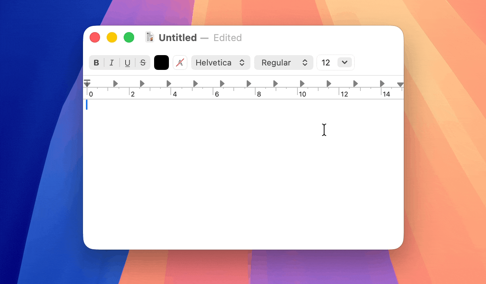

# Plonk

A Spotlight-style floating Python REPL for macOS. Hit a hotkey, get a Python prompt anywhere.



## What it does

Plonk lives in your menu bar and pops up a floating REPL panel on a global hotkey. Behind the scenes it runs a long-lived Python interpreter subprocess, so state (variables, imports) persists between commands until you reset it.

## Usage

- **Toggle the panel:** `Ctrl + Option + Space`
- **Dismiss:** `Esc`, or click anywhere outside the panel
- **Run code:** type a Python expression or statement and hit return
- **History:** `Up` / `Down` arrows scroll through previous commands

### Meta-commands

| Command | What it does |
| --- | --- |
| `%clear` | Clear the visible history |
| `%reset` | Restart the Python interpreter (also re-runs the bootstrap script) |
| `%copy` | Copy the previous output to the clipboard |
| `%copy <expr>` | Evaluate `<expr>` and copy the value (uses `print()`, so you get the value not the repr). Silent on success; errors appear in history. |
| `!<cmd>` | Run `<cmd>` in your shell. For `uv` commands, runs in the detected project directory. |

### Clipboard shortcut

`Cmd + C` inside the panel:
- With text selected → standard copy
- With nothing selected → equivalent to `%copy` (grabs the last output)

## Settings

Open from the menu bar icon → Settings.

- **Python Interpreter:** path to the `python3` binary you want to use. Plonk auto-detects a parent virtualenv (looks upward for a `pyvenv.cfg`) and sets `VIRTUAL_ENV` / `PATH` accordingly.
- **Bootstrap Script:** Python code that runs on interpreter startup. Useful for default imports.
- **Restart Interpreter:** kill and relaunch the subprocess with the current settings.

The keyboard shortcut is currently hard-coded to `Ctrl + Option + Space`.

## How it works

- `MenuBarExtra` for the menu bar entry
- Carbon hot key API for the global shortcut (`HotKeyManager`)
- `NSPanel` with `.nonactivatingPanel` for the Spotlight-style floating window (`FloatingPanel`)
- A persistent Python subprocess driven over stdin/stdout/stderr with a marker-based protocol (`PythonManager`)
- The user's login-shell `PATH` is inherited so tools installed via Homebrew, `uv`, `pyenv`, etc. resolve correctly

The app sandbox is **disabled** — required for the global hotkey and for spawning arbitrary Python interpreters.

## Building

Open `Plonk.xcodeproj` in Xcode and build. Requires macOS 14+ (uses `@Observable`, `MenuBarExtra`, etc.).

## Releasing

`release.sh` runs archive → sign → notarize → staple → DMG in one shot. Output lands in `build/Plonk.dmg`.

One-time setup:

```sh
# Install create-dmg
brew install create-dmg

# Store notary credentials in the keychain (uses an app-specific password
# from appleid.apple.com → Sign-In and Security → App-Specific Passwords)
xcrun notarytool store-credentials "plonk-notary" \
  --apple-id <your-apple-id> \
  --team-id V2CW6Y3N5J \
  --password <app-specific-password>
```

Then:

```sh
./release.sh
```

Signing identity comes from your Developer ID Application certificate in the keychain (Xcode → Settings → Accounts → Manage Certificates).

## Credits

Logo: see `CREDITS.md`.
